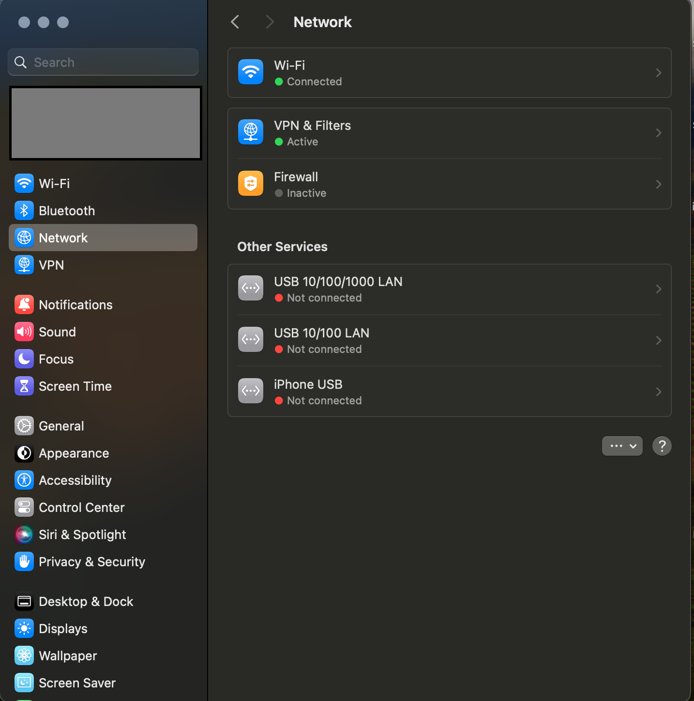

+++
pre = "<i class='fas fa-brain'></i> "
archetype = "default"
title = "Getting Started"
weight = 2
+++

This section is focused on newcomers. Here you can look through guides that will help you with getting your first device up and running (most of them are in the [community wiki](https://github.com/Pwnagotchi-Unofficial/community-wiki)). 

This is a guide for beginners - How to get up and running quickly (headless/without screen)

## Hardware

First of all, you will need a **Raspberry Pi 0 W**. You can get those for around 10-15$ at your local electronics store or pi dealer. You can use [this website](https://rpilocator.com/) to find availability near you. 

Next, a microSD card, you'd be best with 16GB or more. Those go for around 8-10$ on Amazon; I highly recommend you pay extra for premium quality brands like Samsung, Kingston or SanDisk. Also, note that microSD cards have different speed ratings, look for UHS-I class and higher. You can read more about those [in this blogpost by Kingston](https://www.kingston.com/en/blog/personal-storage/memory-card-speed-classes). You will also need a microSD card reader, what form depends on you, I recommend those small USB readers.

A good quality micro USB cable that can do data transfer. Be aware that some cables (especially cheap ones) are wired for _power only_, meaning you won't be able to connect to your pi during the initial setup. I highly recommend you get a higher quality cable, both from a durability and reliability standpoint, and from the "being able to transfer data" standpoint. You can get them from Amazon for around 5-10$ depending on the brand, I can recommend Amazon Basics, Vention and Ugreen.

Lastly, you'd want to get yourself a power bank, or a battery bank. It doesn't really matter which one, you only need standard USB output that can deliver about 1-1.5A, which most power banks can do. Obviously, the higher the capacity (measured in mAh), the longer you can pwn. Neat features may come with the power bank such as being able to charge the power bank while using it, which is good for car deployments, but that depends on you. I can recommend brands like Ugreen, Baseus, Xiaomi, Anker and Viking for power banks.

Optionally, if you dont have a case, get yourself a rubber band or two, so you can put together the pi on your powerbank.

Total cost amounts to around 40$ for decent quality accessories. You can go lower with the price (especially if you re-use things you have like cables and power banks), but I won't recommend cheaping out too much. 

## Software
You will need a computer with basically any OS. I run Linux (Manjaro Xfce), but this should also apply for Windows and Mac aswell. We will be using [Raspberry Imager](https://www.raspberrypi.com/software/) to flash our system. Head to the webpage, you will find installation instructions for every OS imaginable there. 

Next, we will need an image. The official one is no longer maintained, it's outdated and contains a bug that prevents the AI mode from starting. Instead, we will be using a community built image from [jayofelony
](https://github.com/jayofelony), Images are hosted here [https://github.com/jayofelony/pwnagotchi ](https://github.com/jayofelony/pwnagotchi/releases)

Look under assets
- RPiZeroW (32bit) (armhf)
- RPiZero2W, RPi3, RPi4, RPi5 (arm64)

Use software like 7-Zip, WinRAR or gunzip to extract the `.img` file from the archive.

# Flashing the OS
## Selecting OS image and media
There isn't much to this, once you have extracted your `.img` file from the archive, plug in your SD card reader with microSD card in it, and run [Raspberry] Imager. You will see windows similar to this:


In there, choose the OS by clicking the button, scrolling to bottom and selecting "Use custom". Use the popup navigator to locate your `.img` file on your computer. After that, select your storage. If you have only one USB flash drive plugged in, it should be the only option, like this (the text might say something different but you get the gist):


Select that media, but don't hit write yet. In the bottom right corner, there is a cogwheel button for settings. Click on that, we will set some parameters right away, this will make the process much easier.

## OS options
Dont change anything. 

Also choose no at this point


## Flashing
That is everything, you can hit "Save" on the bottom, and hit "Write" on the main screen. This process can take up to few minutes, depending on your SD card, reader and drive from which you are reading the image from. Be patient. When the flashing is done, you will get a message that it is done.

## Setting up pwnagotchi config
If you have followed the guide, your SD card should still be mounted (or connected) to your PC. There should be two partitions, one called "boot" and one called "rootfs". On Windows, you will see just the boot partition, which is okay for now. 


## At this point you have 2 options.
Insert the SD card and boot up the pwnagotchi and edit your config.toml later or add one to the boot partition


Mount the boot partition, and open it. In there, you will create a file named `config.toml`. Open this file in your favourite text editor, and pay close attention to next steps.


```toml
main.name = "pwnagotchi"
main.lang = "en"
main.whitelist = [
  "EXAMPLE_NETWORK",
  "ANOTHER_EXAMPLE_NETWORK",
  "fo:od:ba:be:fo:od",
  "fo:od:ba"
]

ui.display.enabled = true
ui.display.type = "waveshare_3" #Change this to match your screen/ 
ui.display.color = "black"
ui.fps = 1
```
#### Explanation of stuff you probably want to change

`main.name` specifies the name of your pwny. You can enter whatever you like in there.

`main.lang` specifies the language of your pwny. For language reference, see [here](https://pwnagotchi.ai/configuration/#choose-your-unit-s-language)

`main.whitelist` is a list of access points that **WON'T** be pwned, so for example your home WiFi. You can enter it's SSID (Name of the Wi-Fi router) or it's MAC address there.

`main.plugins.grid` controls the bevaiour of the Grid, which is sort of a backend for the pwny, that has statistics, you can message others using it, etc. Read more about Grid [here](https://pwnagotchi.ai/configuration/#set-your-pwngrid-preferences). 

`main.plugins.bt-tether.enabled = true` is necessary to get Bluetooth conenction enabled.

`main.plugins.bt-tether.devices.XXX` here you configure your Bluetooth. You want to delete whichever section you do not use (i.e. if you have Android phone, delete every line with "ios" in it). 

Configuring this can get a little tricky, so here's a rundown of what to change.

`main.plugins.bt-tether.devices.ios-phone.ip` is the IP address at which your pwny will be located at. For simplicity, leave this to default, but you can change it.

`main.plugins.bt-tether.devices.ios-phone.mac` in this field, you will enter your phone's BT MAC address. Guides on how to find those are here for [Android](https://www.esper.io/blog/kiosk-signage-android-mac-address-serial-tracking) and for [iOS](https://www.wikihow.com/Check-Your-iPhone%27s-Bluetooth-Address).

`main.plugins.bt-tether.devices.ios-phone.share_internet = true` change this to true if it isn't, this is needed to share the internet connection of your phone with your pwny (for uploading stats, some plugins, time sync etc.)

`main.plugins.memtemp.enabled = true` enables plugin, that shows you your system's load and temp. Those are nice to know. You can change units and orientation, but what's above works best with phones.

`main.plugins.logtail.enabled = true` enabled plugin that lets you view pwny's log in your phone. Nice for debugging if anything goes ass up, you can disable it when you are done with your pwny.

`ui.web.enabled = true` enables the webUI, keep this enabled, otherwise you won't be able to see your pwny in your phone. However you will have to change some things, see below.

`ui.web.username = "changeme"` and `ui.web.password = "changeme"` as the text says, it is highly recommended to change your login username and password, again, from security standpoint.

`ui.display.enabled = false` this disables hardware display routines, since we don't have a display, we can disable it. 

---

When you are done with the changes, save and close the file. 

# First run
Congratulations, your SD card should be now ready for boot! Safely remove your SD card from your computer, and insert it into your Raspberry Pi. There are two USB ports on your Pi 0, labeled as "PWR IN" and "DATA", see this image:


Insert your USB cable into the "DATA" port, and connect it to your PC. The green LED on your Pi should start blinking quickly for a while, that means it is starting up. In the meantime, you can enable Bluetooth and Hotspot on your phone, so you can get up and running. The process of booting up for the first time can take few minutes or up to tens of minutes depending on your SD card, so give it a little while. In the meantime, you can make yourself a coffee, have a snack, or join our community [Discord](https://discord.gg/PgaU3Vp) and get to know the most amazing people!

## SSH into your pi...
### ... on Windows
If you are on a Windows PC, after a while, the OS should notify you of a new network device. Open your network settings, and you should see a new Ethernet Connection with the type of "RNDIS". This is your pwny. Right click this, choose "Properties", in the menu, find "Internet Protocol Version 4", and click "Properties" on that again. A new window should pop up with loads of fields to fill. You want to check "manual" settings, and enter the following:
- IP address: `10.0.0.1`
- Subnet Mask: `255.255.255.0`
- Gateway: `10.0.0.1`
- DNS Server: `8.8.8.8` and `1.1.1.1`

Accept and close those two windows. Now you can try to enable the internet sharing by right clicking your main network connection (usually Ethernet 1), select "Properties" and "Sharing". In there, tick the box to allow other network users to connect through this connection. If there is a list below, choose your pwny's connection.

You should now be able to connect to your pwny. I recommend using [PuTTY](https://www.putty.org/) to do that. As host, enter `<username>@10.0.0.2` where `<username>` is whatever username you have specified in the Imager. If you haven't, the default is `pi`. Leave the port default `22`. Click "Connect", a new window should pop up, asking for password. Enter the password you have specified in the Imager, if you haven't, then the default is `raspberry`. 
### ... on Linux
This example is based on Manjaro OS with Xfce desktop envorinment. First, open terminal and type in `ifconfig -a`. You should see a list of ethernet interfaces active. Take note of what are available, in my case, I have `eno1` and `lo` (the `lo` interface will always be there, the others might differ in naming). Then, connect your pwny and wait for it to boot. Run `ifconfig -a` again, and you should see a new interface, in my case it was named `enp0s20f0u2u2`, that is your pwny. Take note of that.

Open your Network Manager, you should see a window like this, the amount and names of connections will probably differ but that is okay:


Click the "+" at the bottom. New window will pop up, asking you to choose connection type. Set "Ethernet" and create. 

In this new window, you can enter connection name at the top, and select device that you figured out earlier (in my case it was the `enp0s20f0u2u2`):


After that, head over to "IPv4 Settings", change method to "Manual" and enter details as on the screenshot:


After that, you can save and your connection should work. Open the terminal, and type in `ssh <username>@10.0.0.2`, where `<username>` is whatever username you have specified in the Imager. If you haven't, the default is `pi`. Enter the password you have specified in the Imager, if you haven't, then the default is `raspberry`.


### ... on MacOS
Steps in MacOS Are similar to Linux, and this example is based on Intel MacOS Sonoma, however it shouldn't be too much different for any other mac versions. First of all connect your Raspberry Pi to your Mac, I used an usb to type-c adapter, but if you own a microusb-typec cable you can use that! After you plug it in open your system settings ( >System Settings) and go to the "Network" section. You should see a window like this:



After plugging it in we should automatically see our ethernet connection:


Now click on the new network(RNDIS/Ethernet Gadget for me) and click on Details. You should see a screen popping up and click TCP/IP and set Configure IPv4 from(DHCP to Manually) configure the else like below.


And go to DNS Section now and enter your desired DNS Server(i.e 1.1.1.1 or 8.8.8.8) by clicking + sign like below:


Note: If you cannot connect to the internet from your MacOS After this click on (**...** > Set Service Order...) drag the interface you use for internet to the top. 
After all of these click OK it might ask for your password and then the status should change from 'Self Assigned' IP to 'Connected' you are all done! Open your favorite terminal, and type in `ssh <username>@10.0.0.2`, where `<username>` is whatever username you have specified in the Imager. If you haven't, the default is `pi`. Enter the password you have specified in the Imager, if you haven't, then the default is `raspberry`.


## Checking Bluetooth
If you have connected to your pwny via SSH, you can use the shell to debug stuff. Because we have set everything necessary in advance, there is not really a need to have the shell, but it is helpful to have it in case something is not working.

Now, you can check your phone, if pwny has requested a pairing. If it did, accept it, and you should be connected. You can now open your browser, put in the IP address you have specified in `main.plugins.bt-tether.devices.ios-phone.ip`, or you can try `http://<hostname>.local:8080`, where `<hostname>` is the hostname you have specified in the Imager. You should get a prompt to log-in, insert details you have specified in `ui.web.username` and `ui.web.password`, if you haven't, the the defaults are `changeme` for both username and password. If everything goes well, you should now see the face of your pwny.

### Bluetooth not working
If your bluetooth is not working, you can try these steps:
1) SSH into your pwnagotchi
2) run `sudo bluetoothctl`
3) run `scan on`. Find your phone either by it's name, or MAC address. You will need only MAC address, so the best you can do is to find it in your phone. 
4) run `pair <mac>`, where `<mac>` is your phone's BT MAC address.
5) run `trust <mac>`, where again, `<mac>` is your phone's BT MAC address.
6) In a few moments, you should be prompted (on your phone) to allow communication with pwnagotchi.
7) If the problem still persists, try untrusting and unpairing pwnagotchi from your phone, rebooting both devices and repeating process. Sometimes, you need to repeat this process multiple times for it to work (I need 3 attempts before it started working). If you still have problem, head to ⁠supwnport channel on our Discord.

### Device not connecting (after first pair.)
A way to fix this is to try and convince your mobile device (Whether Android, IOS or Linux) to connect via the Bluetooth tab in your devices settings application. Usually your device will be listed under its hostname E.g. my device is called `DylanJava` so thats what it would be called in the bluetooth tab.
# That is it
Really. You can now shutdown your pwny from the webUI, wait for the green LED to stop blinking, disconnect the USB cable from your PC and from the Pi. Connect it back to the "PWR IN" port, and to your power bank. Give it few minutes to boot, and you can go for a walk. It should automatically connect with your phone, so you can keep track of him on the walk. You should see his face change, and different status messages based on what is currently happening around.

**Happy pwning!**
